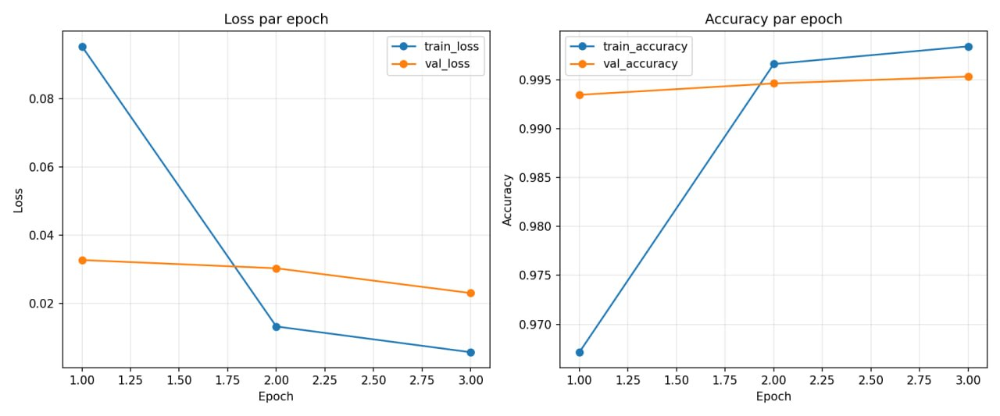
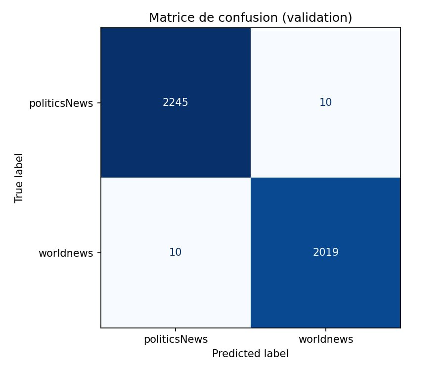
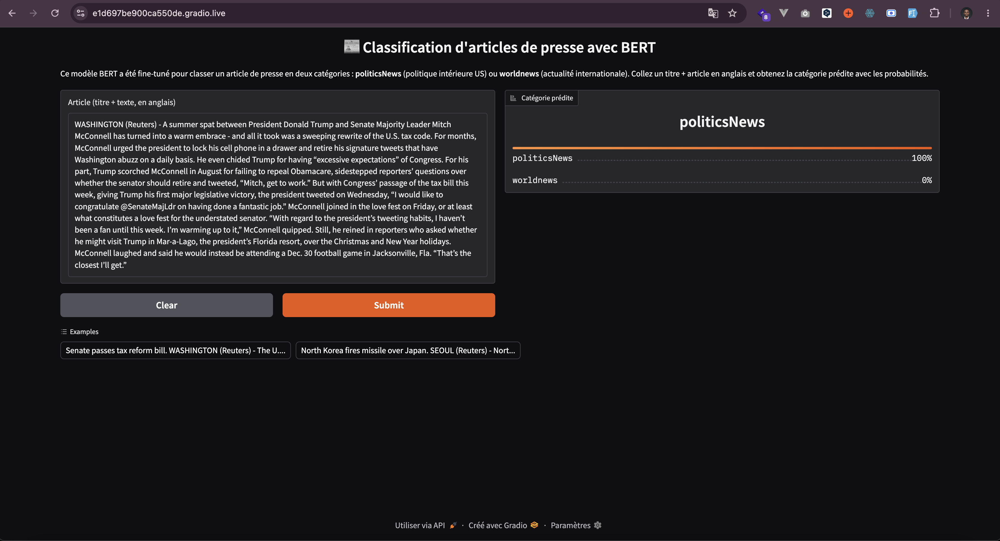

# BERT — Classification d'articles de presse (politicsNews vs worldnews)

> **Devoir Pratique n°3 — NLP avec PyTorch : Fine-tuning de BERT**
> Fine-tuning d'un modèle BERT pré-entraîné pour classer un article de presse
> (`title + text`) selon son sujet (`subject`), avec une boucle d'entraînement
> PyTorch écrite manuellement et une démo interactive Gradio.

**Binôme :** Igor BALLO & Christian KOSSI
**Modèle :** `bert-base-uncased` (anglais)
**Tâche :** classification binaire `politicsNews` vs `worldnews`

---

## 1. Présentation du dataset

- **Source :** *Fake and Real News Dataset* (ISOT / Kaggle), fichier `True.csv`
  (articles réels, agence Reuters).
- **Entrée du modèle :** concaténation `title + " " + text`.
- **Cible :** colonne `subject`, restreinte aux deux classes présentes.

### Statistiques

| Élément | Valeur |
|---|---|
| Nombre total d'exemples | **21 417** |
| Nombre de classes | **2** |
| `politicsNews` | 11 272 (52,6 %) |
| `worldnews` | 10 145 (47,4 %) |
| Ratio de déséquilibre | **1,11 : 1** (< 2:1 → pas de rééquilibrage nécessaire) |
| Longueur des textes (mots) | min 4 · médiane 369 · moyenne 396 · max 5 181 |
| Percentiles (mots) | p75 = 534 · p90 = 785 · p95 = 904 |

Les classes sont quasi équilibrées : aucune stratégie de rééquilibrage
(pondération de la loss, sur/sous-échantillonnage) n'est nécessaire. Le split
train/validation est néanmoins **stratifié** pour préserver ces proportions.

### Exemples (5)

| subject | extrait (title + text) |
|---|---|
| politicsNews | *"As U.S. budget fight looms, Republicans flip their fiscal script — WASHINGTON (Reuters) - The head of a conservative Republican faction..."* |
| politicsNews | *"U.S. military to accept transgender recruits on Monday: Pentagon — WASHINGTON (Reuters) - Transgender people will be allowed..."* |
| politicsNews | *"Senior U.S. Republican senator: 'Let Mr. Mueller do his job' — WASHINGTON (Reuters) - The special counsel investigation..."* |
| worldnews | *"North Korea fires missile over Japan — SEOUL (Reuters) - North Korea launched a ballistic missile..."* |
| worldnews | *"EU leaders meet to discuss migration policy — BRUSSELS (Reuters) - European Union leaders gathered..."* |

*(Les exemples `worldnews` ci-dessus sont illustratifs ; reproduisez les vôtres
avec `python dataset.py`.)*

---

## 2. Modèle et choix techniques

| Choix | Valeur | Justification |
|---|---|---|
| Modèle pré-entraîné | `bert-base-uncased` | Dataset 100 % anglais ; modèle de référence pour la classification. |
| Tête de classification | linéaire sur `[CLS]`, `num_labels=2` | Standard `BertForSequenceClassification` ; seul `Trainer` est interdit, pas la classe modèle. |
| `max_length` | **256 tokens** | Médiane ≈ 369 mots (~480 tokens) : les articles sont longs, mais l'**attaque (lead paragraph + agence)** d'une dépêche est très discriminante. 256 capture ce signal tout en divisant par ~2 le coût mémoire/temps vs 512. |
| Tokenizer | `BertTokenizerFast`, `[CLS]/[SEP]`, padding + troncature | Le **masque d'attention** est renvoyé et passé au modèle (sinon résultats dégradés). |
| Optimiseur | AdamW, `weight_decay=0.01` | Recommandé pour le fine-tuning de BERT. |
| Learning rate | `2e-5` | Plage 2e-5–5e-5 ; un LR trop élevé provoque l'oubli catastrophique. |
| Scheduler | linéaire avec warmup (`warmup_ratio=0.1`) | Stabilise les premières itérations. |
| Gradient clipping | `max_norm=1.0` | Évite l'explosion du gradient. |
| Loss | `CrossEntropyLoss` | Attend des **labels entiers** (pas one-hot). |
| Batch size | 16 | Compromis VRAM / vitesse. |
| Epochs | 3 | BERT converge vite ; au-delà, risque d'overfitting. |
| Seed | 42 | Fixée pour `random`, `numpy`, `torch` (+ cuDNN déterministe). |

**Critère de sauvegarde :** le meilleur modèle est conservé sur la **meilleure
`val_loss`** (dossier `checkpoints/best_model`).

---

## 3. Étapes de réalisation et difficultés

1. **Inspection du dataset** (`dataset.py` en mode test) : comptage des classes,
   distribution, longueurs, affichage d'exemples.
2. **Pipeline de données** : `Dataset` PyTorch personnalisé tokenisant à la volée,
   split 80/20 stratifié.
3. **Boucle d'entraînement manuelle** : `train_epoch` / `eval_epoch`, sans
   `Trainer` HF, avec `model.train()` / `model.eval()` et `torch.no_grad()` en
   validation.
4. **Suivi & sauvegarde** : collecte des métriques par epoch, sauvegarde du
   meilleur modèle, export `history.json`.
5. **Visualisations** : courbes loss/accuracy + matrice de confusion.
6. **Démo Gradio** : chargement du meilleur modèle et interface interactive.

**Difficultés rencontrées (à compléter par le binôme) :** gestion de la longueur
des articles (choix de `max_length`), temps d'entraînement sur CPU vs GPU,
reproductibilité (seed).

---

## 4. Résultats

Entraînement réalisé sur **Google Colab (GPU Tesla T4)**, 3 epochs, sur
l'intégralité du dataset (17 133 exemples d'entraînement, 4 284 de validation).

**Courbes d'apprentissage (loss & accuracy) :**



**Matrice de confusion (validation) :**



*(Historique complet des métriques disponible dans `checkpoints/history.json`.)*

### Métriques par epoch

| Epoch | train_loss | val_loss | train_acc | val_acc | val_f1 | lr |
|---|---|---|---|---|---|---|
| 1 | 0.0932 | 0.0466 | 0.9674 | 0.9893 | 0.9893 | 1.48e-05 |
| 2 | 0.0145 | 0.0268 | 0.9961 | 0.9944 | 0.9944 | 7.41e-06 |
| 3 | 0.0060 | 0.0235 | 0.9982 | 0.9946 | **0.9946** | 0.00e+00 |

**Meilleur modèle :** epoch 3 (val_loss = **0.0235**).

### Rapport de classification (validation)

| Classe | Précision | Rappel | F1 | Support |
|---|---|---|---|---|
| politicsNews | 0.9938 | 0.9960 | 0.9949 | 2 255 |
| worldnews | 0.9956 | 0.9931 | 0.9943 | 2 029 |
| **accuracy** | | | **0.9946** | 4 284 |
| macro avg | 0.9947 | 0.9946 | 0.9946 | 4 284 |
| weighted avg | 0.9946 | 0.9946 | 0.9946 | 4 284 |

### Analyse

Le fine-tuning converge très vite (dès l'epoch 1, val_acc ≈ 98,9 %), ce qui
illustre l'apport du **transfer learning** : BERT, pré-entraîné sur de larges
corpus, n'a besoin que de quelques epochs pour s'adapter à la tâche. La
`val_loss` continue de **décroître** sur les 3 epochs (0,0466 → 0,0268 →
0,0235) et l'écart entre train_acc (0,998) et val_acc (0,995) reste très faible :
**pas de surapprentissage** notable. Les deux classes sont très bien séparées
(F1 ≈ 0,994 chacune), ce qui s'explique par des marqueurs stylistiques et
géographiques forts dans les dépêches (lieu d'origine, vocabulaire politique
intérieur vs international).

### Démo Gradio

La démo a été lancée et testée avec succès via Gradio (`python demo.py --share`).

> ⚠️ Les liens `gradio.live` sont **temporaires** (valides ~72 h). Pour une
> démo durable, relancer `python demo.py` localement après installation.

Exemple de prédiction (article classé `politicsNews` avec ses probabilités) :



Interface complète avec champ de saisie et exemples pré-remplis :


---

## 5. Installation & exécution

```bash
# 1. Dépendances
pip install -r requirements.txt

# 2. Données : placez True.csv dans data/
#    data/True.csv

# 3. Entraînement (GPU recommandé)
python train.py --csv data/True.csv --epochs 3 --batch_size 16 --max_length 256

#    Test rapide sur un petit échantillon :
python train.py --max_samples 2000 --epochs 1

# 4. Démo interactive
python demo.py
#    puis ouvrez l'URL locale affichée (http://127.0.0.1:7860)
```

---

## 6. Structure du projet

```
bert-classification-news/
├── data/                 # True.csv (non versionné, voir .gitignore)
├── dataset.py            # TextClassificationDataset + chargement/split
├── model.py              # chargement tokenizer + modèle BERT
├── train.py              # boucle train/eval PyTorch + main
├── demo.py               # interface Gradio
├── utils.py              # seed, métriques, visualisations
├── requirements.txt
├── .gitignore
└── README.md
```

---

## 7. Répartition du travail

| Tâche | Igor BALLO | Christian KOSSI |
|---|---|---|
| Inspection dataset & `dataset.py` | ✓ | |
| `model.py` & `train.py` | ✓ | ✓ |
| `demo.py` (Gradio) | | ✓ |
| Visualisations & `utils.py` | ✓ | |
| README & rapport | ✓ | ✓ |

---

## 8. Notes

- Le **`Trainer` de Hugging Face n'est pas utilisé** : la boucle est en PyTorch pur.
- Les fichiers lourds (CSV, checkpoints, images) sont exclus via `.gitignore`.
- Reproductibilité assurée par une seed fixe (`--seed 42`).
